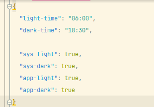
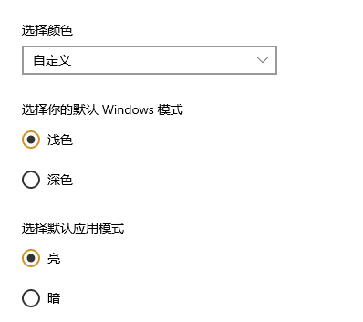

# Windows-Auto-Mode v1.0.0 使用方法

1.   在文件夹下找到**setting.json**,点击设置程序的配置.
     
     

-   light-time : 设置浅色模式开始的时间
-   dark-time : 设置深色模式开始的时间点
-   sys-light&dark : 设置windows系统深浅模式
-   app-light&dark : 设置默认应用深浅模式 
    具体参照如下:
    
    

2.  设置开机自启动
-   在`C:\Users\Administrator\AppData\Roaming\Microsoft\Windows\Start Menu\Programs\Startup`
    此路径下找到文件夹,复制`main.exe`的快捷方式进去,即可完成开机自动启动此程序
    
-   后期版本将会更新自动开机自启动的功能,敬请期待

3.  运行main.exe程序
-   以上两个步骤设置好之后,把文件夹转移到一个固定的位置,即可点击exe程序实现功能啦!